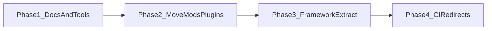

# Monorepo target layout and migration phases

The repository **stays one Git repo**. The goal is **clear boundaries** between framework, mods, plugins, templates, docs, and tooling so users, modders, and contributors can navigate predictably.

## Target topology (directional)

| Top-level | Purpose |
|-----------|---------|
| `framework/` or keep root `FrikaMF` | Core MelonLoader framework assembly — exact extraction is optional if root layout is documented |
| `mods/` | Gameplay mods (`FMF.Mod.*`, `FMF.*.dll` style) |
| `plugins/` | FFM plugins (`FFM.Plugin.*`) |
| `templates/` | Already exists — scaffolds only |
| `docs-site/` | Docusaurus — **do not rename** without updating `baseUrl`, redirects, and CI |
| `tools/` | Repo maintenance: hook catalog generator, codegen stubs |
| `scripts/` | Release automation (existing) |

**Binaries**: prefer **GitHub Releases** (and pre-releases for beta) over committing DLLs. See [Release channels](../reference/release-channels.md).

## Phased migration (no big-bang)

| Phase | Scope | Exit criteria |
|-------|--------|---------------|
| **1** | Docs, `tools/`, naming wiki, hook catalog script | Docusaurus build green; script generates catalog |
| **2** | `git mv` ModsAndPlugins → `mods/` / `plugins/` (or `packages/mods`) | Update `.csproj` paths, `moduleCatalog.ts`, README links |
| **3** | Optional: isolate framework sources under `framework/` | `dotnet build` for solution subset green |
| **4** | CI matrix: docs + dotnet; `plugin-client-redirects` for old URLs | PR checks match local workflow |

## Path updates checklist (when moving trees)

- [ ] `FrikaMF.sln` project paths
- [ ] Relative paths in `README.md`, `CHANGELOG.md`
- [ ] [`docs-site/src/data/moduleCatalog.ts`](https://github.com/mleem97/gregFramework/blob/master/docs-site/src/data/moduleCatalog.ts) `wikiPath` / `releasePath`
- [ ] [`docs-site/docusaurus.config.js`](https://github.com/mleem97/gregFramework/blob/master/docs-site/docusaurus.config.js) redirects
- [ ] Wiki pages that mention old paths (search for `ModsAndPlugins`)

## Related

- [Repo inventory](./repo-inventory.md)
- [FMF hook naming](../reference/fmf-hook-naming.md)
